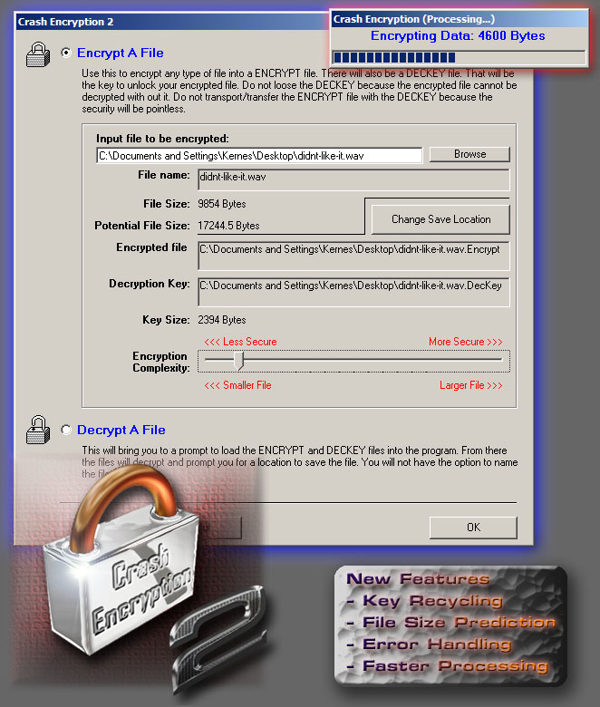



## Crash Encryption 2\! \(UPDATED\!\)

### Description

Encrypt any type of file using an encryption based off my last encryption program. This one is faster, more versitile, less rescource hungry, and smaller then my previous submission, Crash Encryption. This new version will encrypt any type of file without a hick-up. I've successfully encrypted and decrypted movies, waves, pictures, documents, and more. I built the entire thing into an easy to use and understand module. I've also commented as much as I thought I could. I'd like to thank Derek Haas for the I/O Module. It made making this program a lot faster and simpler. I finished this algorythm in a record breaking (at least for myself) 6 hours. The code looks clean. Please comment.

**NEWLY UPDATED** 02-05-06

I've added the option to change to key cycles. Now the same key can be used up to 41 times per byte in order to keep the key file size down. Some minor changes have been made, including some error handling and size speculation.

More is sure to come. Please let me know what you think.
 
### More Info
 
Currently, no side affects found. However, there is no warrenty for this software and I do not take any responsibility for any problems this software may cause.

Note: This software WILL overwrite files without prompting. That means do NOT save the files with the original file names because that file will will be over written.

             |
---                |---
**Submitted On**   |2006-02-05 01:47:48
**By**             |[Matthew Kernes](https://github.com/Planet-Source-Code/PSCIndex/blob/master/ByAuthor/matthew-kernes.md)
**Level**          |Intermediate
**User Rating**    |4.2 (21 globes from 5 users)
**Compatibility**  |VB 6\.0
**Category**       |[Encryption](https://github.com/Planet-Source-Code/PSCIndex/blob/master/ByCategory/encryption__1-48.md)
**World**          |[Visual Basic](https://github.com/Planet-Source-Code/PSCIndex/blob/master/ByWorld/visual-basic.md)
**Archive File**   |[Crash\_Encr196996252006\.zip](https://github.com/Planet-Source-Code/matthew-kernes-crash-encryption-2-updated__1-64192/archive/master.zip)

